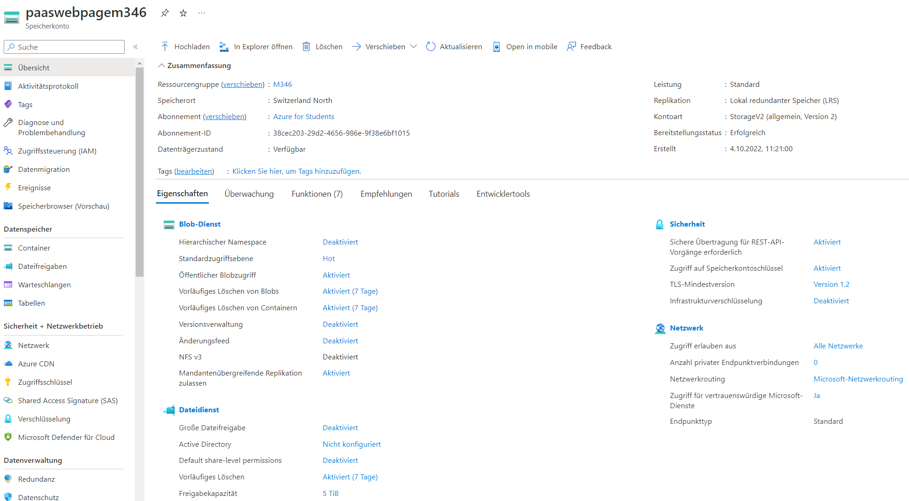
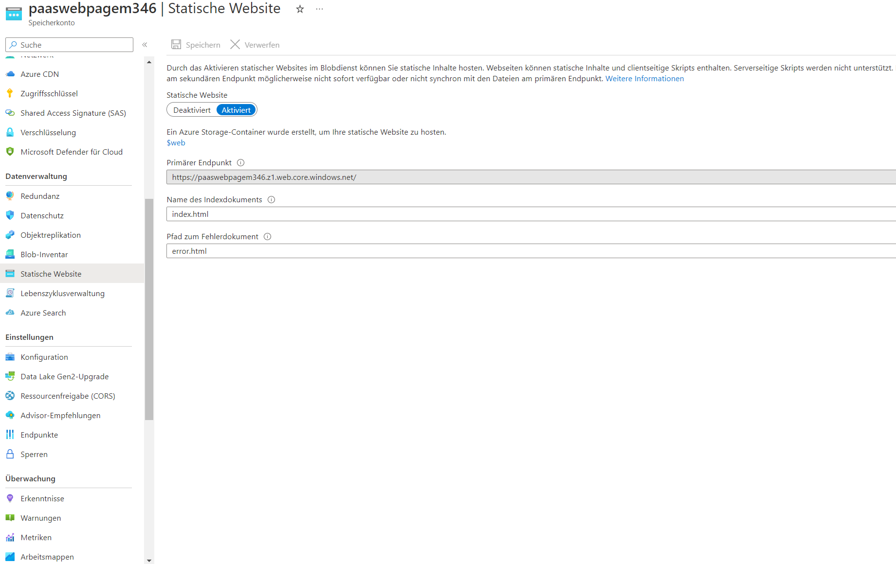
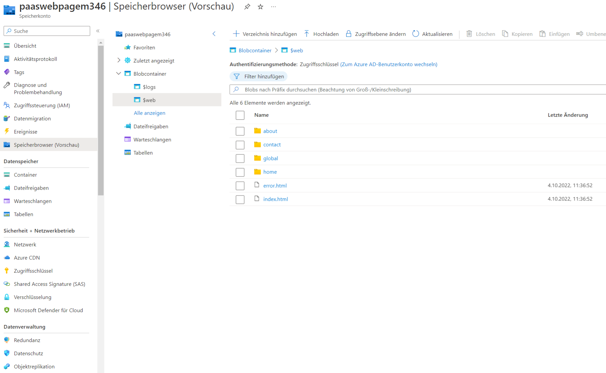
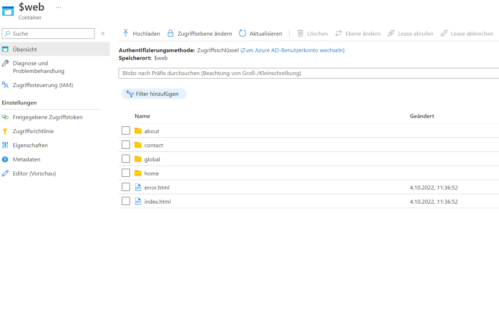
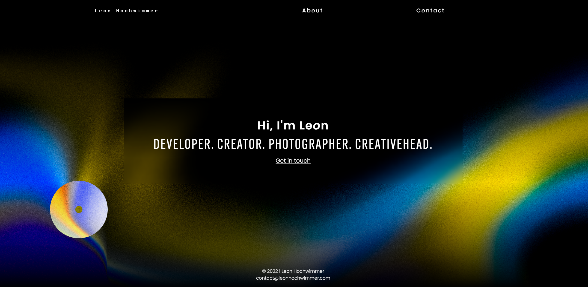

# Eine statische Webseite erstellen und mit PaaS in der Cloud publizieren

## Inhalt

- [Gedanken](#gedanken)

- [Ziel](#ziel)

- [Vorgehen](#vorgehen)

- [Übersicht](#Übersicht)

- [Bilder](#bilder)

- [Zur Website](https://paaswebpagem346.z1.web.core.windows.net/)

---

## Gedanken

Ich habe mir zuerst einmal Gedanken gemacht, was ich genau innerhalb von Azure, in der Cloud hosten beziehungsweise publizieren möchte. Entschieden habe ich mich, eine bisherige [Website](https://leonhochwimmer.com) aus vergangener Zeit in die Cloud zu bringen.

Nun musste ich einen Teil des Gelernten aus dem Unterricht wieder Revue passieren lassen. Wie der Aufgabe zu entnehmen, handelt es sich ganz konkret um [Platform as a Service](https://sites.google.com/bbzbl-it.ch/modul346/paas).

Nachdem ich mich mit einem Teil des Unterrichtstoffes nochmals auf der Modulwebsite befasst habe, habe ich die Suche nach diversen Inhalten im Internet gesucht. Durch das erneute Befassen mit den im Unterricht behandelten Themata konnte ich mein Verständnis verbessern und mir im Endeffekt eine noch bessere Vorstellung über diese erste Aufgabe machen.

---

## Ziel

Als konkrete Zielsetzung entstand also, das Setzen einer bisher bestehenden Website von mir, in die Cloud von Microsoft Azure nach dem Prinzip von PaaS.

---

## Vorgehen

### Ressourcengruppe

In Microsoft Azure habe ich initial eine neue Ressourcengruppe basierend auf dem Modulnamen erstellt um alle der kommenden Aufgaben zentral in einer Gruppe auffinden zu können.

### Speicherkonto und Website anlegen

Danach habe ich ein neues Speicherkonto erstellt um anschliessend eine statische Webseite darin anlegen zu können. Innerhalb meinem neu erstellten Speicherkonto ist es nun möglich die Dateien für eine statische Website hochzuladen. Erstmalig muss aber noch eine neue Seite in diesem Speicher erstellt werden (siehe [hier](#create-static-page)).

### Übersicht

Nach dem die Ordnerstruktur übernommen wurde und die ganzen Dateien in die Cloud gebracht wurden, kann zu guter Letzt ein Blick auf den _$web_ Ordner geworfen werden, in welchem sich die Quelle der Seite befindet. Nun kann ich die einzigartige URL verwenden, welche ich bei der Initialisierung des Speicherkontos definiert habe, um meine [Seite](https://paaswebpagem346.z1.web.core.windows.net/) im Internet aufrufen zu können.

---

## Bilder

[Speicherkonto](#speicherkonto-und-website-anlegen)

[statische Website](#speicherkonto-und-website-anlegen)

[Speicherbrowser](#speicherkonto-und-website-anlegen)

[Quellverzeichnis](#übersicht)

[Website auf Azure](https://paaswebpagem346.z1.web.core.windows.net/)
