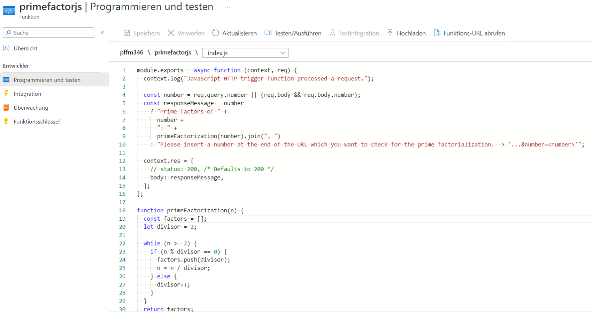
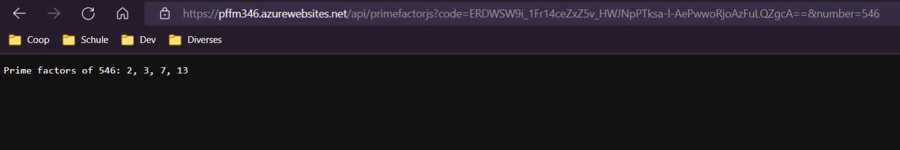

# Eine Azure Funktion für die Primfaktorenzerlegung schreiben und in der Cloud zur Verfügung zu stellen.

## Inhalt

- [Gedanken](#gedanken)

- [Ziel](#ziel)

- [Vorgehen](#vorgehen)

- [Übersicht](#übersicht)

- [Quellcode](#quellcode)

- [Bilder](#bilder)

- [Zur Website](https://pffm346.azurewebsites.net/api/primefactorjs?code=ERDWSW9i_1Fr14ceZxZ5v_HWJNpPTksa-l-AePwwoRjoAzFuLQZgcA==&number=)

---

## Gedanken

Zum Anfang musste ich mir Gedanken zum Auftrag und dem weiteren Vorgang machen.

Da wir bereits eine Azure Funktion im Unterricht erstellt hatten, waren mir einige Schritte schon bekannt. Andererseits konnte ich mich an das meiste nicht mehr erinnern. Entsprechend habe ich einen Teil der dazugehörigen Dokumentation von [Azure](https://learn.microsoft.com/en-us/azure/azure-functions/functions-reference-node) gelesen um ein volles Verständnis der Thematik zu erlangen.

Zum Schluss musste ich mir noch Gedanken über die mathematischen Hintergründe der Funktion machen um die Primfaktorzerlegung adäquat implementieren kann. Dabei muss eine Zahl als Parameter in der URL mitgegeben und anschliessend vom Programm ausgelesen werden um zerlegt zu werden.

---

## Ziel

Mein Ziel war also im Endeffekt, das Programm der Primfaktorzerlegung in die Azure Funktion zu implementieren.

---

## Vorgehen

### Ressourcengruppe

In Microsoft Azure habe ich initial eine neue Ressourcengruppe basierend auf dem Modulnamen erstellt um alle der kommenden Aufgaben zentral in einer Gruppe auffinden zu können.

### Anwendung programmieren

JavaScript

### Übersicht

Nach dem die Ordnerstruktur übernommen wurde und die ganzen Dateien in die Cloud gebracht wurden, kann zu guter Letzt ein Blick auf den _$web_ Ordner geworfen werden, in welchem sich die Quelle der Seite befindet. Nun kann ich die einzigartige URL verwenden, welche ich bei der Initialisierung des Speicherkontos definiert habe, um meine [Seite](https://paaswebpagem346.z1.web.core.windows.net/) im Internet aufrufen zu können.

---

## Quellcode

```js
module.exports = async function (context, req) {
  context.log("JavaScript HTTP trigger function processed a request.");

  const number = req.query.number || (req.body && req.body.number);
  const responseMessage = number
    ? "Prime factors of " +
      number +
      ": " +
      primeFactorization(number).join(", ")
    : "Please insert a number at the end of the URL which you want to check for the prime factorialization. -> '...&number=<number>'";

  context.res = {
    body: responseMessage,
  };
};

function primeFactorization(n) {
  const factors = [];
  let divisor = 2;

  while (n >= 2) {
    if (n % divisor == 0) {
      factors.push(divisor);
      n = n / divisor;
    } else {
      divisor++;
    }
  }
  return factors;
}
```

---

## Bilder


[Funktions-App erstellen](#link)


[Zum Programmieren navigieren](#link)



[Azure Funktion](#link)


[Seitenansicht standard](#link)



[Seitenansicht Zahl](#link)
